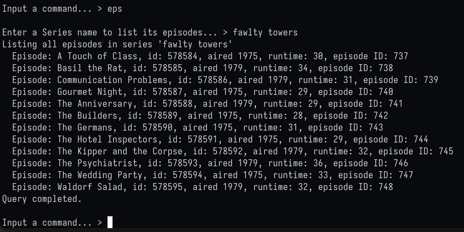

## 3380 Final Project - IMDb Non-Commercial Dataset

### Running the interface

To run our interface, run `make run` while in the program's root directory in your terminal.

A config file (`auth.cfg`) is required in the root directory. In this file there must be two entries:

```plaintext
username=
password=
```

Where username is your UMnetID, and password is your set password (for Uranium specifically). The program will read this during startup in order to connect to the Uranium server.

### Creating the database

The database is created through the interface. Once the interface is running, and you are connected to the Uranium server, run `dbc` as listed in the interface's help menu. This command will create the tables with the established schema in the source files (`./sql/schema.sql`).


### Populating

Once the tables are created, run `dbr` to populate the database. This is likely to take a while depending on your machine; expect ~30 minutes. The interface will periodically output which table is being populated as it progresses. Once complete, the user will be sent back to the main menu for further querying.


### Querying

Various queries can be executed through the interface; use the `h` command to view the help menu at any time. Below is an example screenshot.

